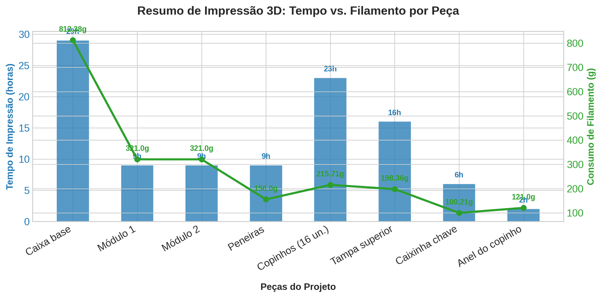

# 🌱 Horta Vertical Hidropônica

Trabalho final do curso de **Modelagem e Impressão 3D** — Instituto Ramacrisna, Betim/MG.

Professor: **Guilherme**

---

## 📋 Índice

- [Sobre a Atividade](#-sobre-a-atividade)
- [Escolha do Tema](#-escolha-do-tema)
- [Objetivo do Projeto](#-objetivo-do-projeto)
- [Metodologia](#-metodologia)
- [Peças do Projeto](#-peças-do-projeto)
- [Tabela Resumo](#-tabela-resumo)
- [Totais Gerais](#-totais-gerais-do-projeto)
- [Materiais e Itens Adicionais](#-materiais-e-itens-adicionais)
- [Desafios e Retrabalhos](#-desafios-e-retrabalhos)
- [Resultado Final](#-resultado-final)
- [Aprendizados](#-aprendizados)
- [Agradecimentos](#-agradecimentos)

---

## 📖 Sobre a Atividade

Atividade proposta pelo professor Guilherme. A turma recebeu uma lista de temas possíveis, mas cada aluno teve liberdade para escolher o que desenvolver.

Regra principal: **não era permitido baixar modelos prontos da internet** — todas as peças precisariam ser modeladas do zero.

- 🛠️ Ferramenta utilizada: **Tinkercad**
- ⏱️ Tempo total dedicado à modelagem: **~16 horas**

---

## 🎯 Escolha do Tema

Tema escolhido: **Horta Vertical Hidropônica**

No início houve um pequeno imprevisto: a colega Bárbara também estava pensando em desenvolver uma horta. Cheguei a propor que ela seguisse com a ideia, mas ela optou por não continuar com o tema. Ao final, cada um seguiu com seu próprio projeto sem conflitos.

---

## 🎯 Objetivo do Projeto

- Avaliar as habilidades de modelagem 3D desenvolvidas ao longo do curso
- Projetar um sistema funcional de horta vertical hidropônica, com peças 100% autorais
- Utilizado como referência conceitual um projeto disponível na comunidade da Bambu Lab (apenas como base de inspiração para o sistema, não copiado)
- Aplicar conhecimentos de modelagem, encaixe de peças e otimização de impressão

---

## 🧩 Metodologia

- Modelagem 100% feita no **Tinkercad**
- Projeto dividido em **8 grupos de peças**
- Peças pensadas "de baixo para cima" (da base até a tampa superior)
- Um dos desafios de projeto: criar um **anel alongado** para os copinhos, aumentando o diâmetro de encaixe

---

## 🔩 Peças do Projeto

### 1. Caixa Base

Impressa em **duas partes**, devido ao tamanho da peça e para otimizar o tempo de impressão.

| | Tempo | Filamento (PLA) |
|---|---|---|
| Parte 1 | 23h | 586,38g |
| Parte 2 | 6h | 226g |
| **Subtotal** | **29h** | **812,38g** |

> **Observação:** para ganhar tempo, foi reduzida a porcentagem de preenchimento (infill), o que exigiu um retrabalho posterior com pintura para melhorar o acabamento.

---

### 2. Módulo 1

| Tempo | Filamento (PLA) |
|---|---|
| 9h | 321g |

> **Observações:**
> - A parte inferior precisou ser impressa separadamente, pois o tamanho final do módulo excedia o limite da área de impressão da impressora.
> - Houve uma falha de impressão no encaixe do copinho, corrigida com retrabalho usando cola.

---

### 3. Módulo 2

| Tempo | Filamento (PLA) |
|---|---|
| 9h | 321g |

> **Observação:** assim como no Módulo 1, houve falha de impressão no ponto de encaixe do copinho, também corrigida com cola.

---

### 4. Peneiras (1, 2 e 3)

Impressas **uma de cada vez**.

| Tempo (cada) | Filamento (cada) | Total |
|---|---|---|
| 3h | 52g | 9h / 156g |

---

### 5. Copinhos (16 unidades)

| Tempo | Filamento (PLA) |
|---|---|
| 23h | 215,71g |

---

### 6. Tampa Superior

| Tempo | Filamento (PLA) |
|---|---|
| 16h | 198,36g |

---

### 7. Caixinha da Chave Liga/Desliga

| Tempo | Filamento (PLA) |
|---|---|
| 6h | 100,21g |

> **Observação:** peça não estava no planejamento inicial. Só depois de montar o sistema elétrico percebi a necessidade de um encaixe para a chave liga/desliga, o que exigiu modelar essa caixinha adicional.

---

### 8. Anel do Copinho

| Tempo | Filamento (PLA) |
|---|---|
| 2h | 121g |

> **Observação:** criado para aumentar o diâmetro de encaixe do copinho na estrutura.

---

## 📊 Tabela Resumo

| Peça | Tempo | Filamento (PLA) |
|---|---|---|
| Caixa base (2 partes) | 29h | 812,38g |
| Módulo 1 | 9h | 321g |
| Módulo 2 | 9h | 321g |
| Peneiras (1, 2 e 3) | 9h | 156g |
| Copinhos (16 un.) | 23h | 215,71g |
| Tampa superior | 16h | 198,36g |
| Caixinha chave liga/desliga | 6h | 100,21g |
| Anel do copinho | 2h | 121g |
| **TOTAL** | **103h** | **2.245,66g** |

---

## 🧮 Totais Gerais do Projeto

- ⏱️ **Tempo total de impressão:** 103 horas
- 🧵 **Filamento total consumido:** 2.245,66 g de PLA (≈ 2,25 kg)
- 💻 **Tempo de modelagem (Tinkercad):** ~16 horas
- 🧩 **Total de grupos de peças:** 8
- 🔢 **Total de peças físicas impressas:** ~26 (considerando as 16 unidades de copinhos e as 3 peneiras individualmente)

---

## 🛒 Materiais e Itens Adicionais

Além das peças impressas em 3D, o projeto exigiu a compra de itens complementares para o funcionamento do sistema hidropônico:

- **Bomba de aquário** — responsável pela circulação da água no sistema
- **Selador** — aplicado no fundo da caixa base para evitar vazamento de água
- **Tinta** — usada no retrabalho de acabamento/pintura da caixa base
- **Mangueira** (pedaço) — para condução da água entre os módulos

> *Esses itens não fazem parte da modelagem/impressão 3D, mas foram essenciais para transformar as peças impressas em um sistema hidropônico funcional.*

---

## ⚠️ Desafios e Retrabalhos

- Redução do preenchimento na caixa base para ganhar tempo → exigiu pintura de acabamento posterior
- Limitação da área de impressão (eixo X) obrigou a dividir o Módulo 1 em duas partes
- Falhas de impressão nos encaixes dos copinhos dos Módulos 1 e 2 → corrigidas com cola
- Necessidade não planejada da caixinha da chave liga/desliga, criada já na fase final do projeto
- Criação de um anel alongado para ajustar o diâmetro de encaixe dos copinhos

---

## ✅ Resultado Final

Sistema completo: caixa base + 2 módulos + 16 copinhos + peneiras + tampa + caixinha da chave + anéis.

---

## 💡 Aprendizados

- Importância do planejamento de peças considerando os limites da impressora
- Necessidade de prever componentes elétricos/mecânicos antes de finalizar a modelagem
- Soluções criativas de retrabalho (pintura, colagem) quando a impressão não sai como esperado
- Ganho de experiência prática em modelagem no Tinkercad e em fluxo de impressão 3D

---

## 🙏 Agradecimentos

- Professor **Guilherme**
- Instituto Ramacrisna — Betim/MG

---

Projeto desenvolvido como trabalho final do curso de Modelagem e Impressão 3D 🌱
